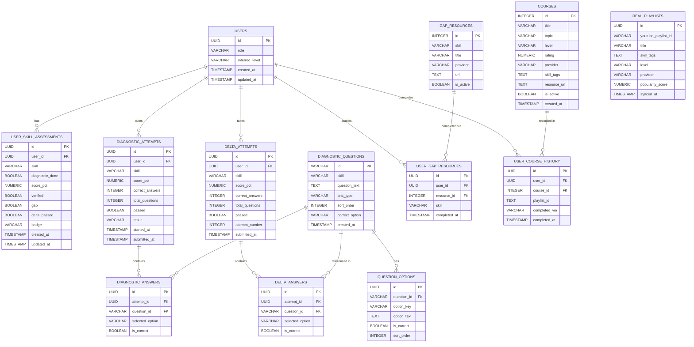

# Database Schema Documentation
## LearningPath Recommendation Engine

---

## Table of Contents

1. [Entity Relationship Diagram](#entity-relationship-diagram)
2. [Database Tables Overview](#database-tables-overview)
3. [Detailed Table Mappings](#detailed-table-mappings)
4. [Relationships and Foreign Keys](#relationships-and-foreign-keys)
5. [Normalization Principles](#normalization-principles)
6. [Index Strategy](#index-strategy)
7. [Data Examples](#data-examples)

---

## Entity Relationship Diagram



---

## Database Tables Overview

The database is structured in **4 main domains:**

| Domain | Tables | Purpose |
|---|---|---|
| **User Domain** | USERS | User identity and goal tracking |
| **Assessment Domain** | USER_SKILL_ASSESSMENTS, DIAGNOSTIC_QUESTIONS, QUESTION_OPTIONS, DIAGNOSTIC_ATTEMPTS, DIAGNOSTIC_ANSWERS, DELTA_ATTEMPTS, DELTA_ANSWERS | Skill verification tests and results |
| **Course Domain** | COURSES, GAP_RESOURCES, REAL_PLAYLISTS | Course catalog and bridge study material |
| **History Domain** | USER_COURSE_HISTORY, USER_GAP_RESOURCES | Completion tracking and progress |

Each assessment domain follows this hierarchical pattern:

```
Skill Assessment (per user per skill)
    └── Diagnostic Attempt
            └── Diagnostic Answers (5 answers)
    └── Delta Attempt (only if gap detected)
            └── Delta Answers (5 answers)
```

---

## Detailed Table Mappings

---

### 1. USERS Table

**Purpose:** Core user identity table. Stores user ID and goal/role for roadmap generation.

| Column | Type | Constraints | Explanation |
|---|---|---|---|
| id | UUID | Primary Key | Unique identifier for each user, autogenerated |
| role | VARCHAR(100) | NOT NULL | User's learning goal e.g. `Backend Developer`, `Frontend Developer` |
| inferred_level | VARCHAR(20) | NOT NULL, DEFAULT=`Beginner` | Auto-detected tier: Beginner / Intermediate / Advanced |
| created_at | TIMESTAMP | NOT NULL, DEFAULT=NOW() | Account creation timestamp |
| updated_at | TIMESTAMP | NOT NULL, DEFAULT=NOW(), ONUPDATE=NOW() | Last modification timestamp |

**Why this table exists:**
- Foundation for all user-specific roadmap and assessment data
- `role` drives which skill curriculum is assigned (Backend Developer → Python, SQL, FastAPI, Docker)
- `inferred_level` is auto-promoted based on how many skills are verified

**Sample Row:**
```
id:              550e8400-e29b-41d4-a716-446655440001
role:            Backend Developer
inferred_level:  Beginner
created_at:      2024-01-15 10:30:00+00
```

---

### 2. USER_SKILL_ASSESSMENTS Table

**Purpose:** Tracks the assessment state of each skill for each user. One row per user per skill.

| Column | Type | Constraints | Explanation |
|---|---|---|---|
| id | UUID | Primary Key | Unique record identifier |
| user_id | UUID | FK (users.id), NOT NULL, INDEXED | Links to parent user |
| skill | VARCHAR(100) | NOT NULL | Skill name e.g. `Python`, `SQL`, `FastAPI`, `Docker` |
| diagnostic_done | BOOLEAN | NOT NULL, DEFAULT=FALSE | Whether diagnostic test has been completed |
| score_pct | NUMERIC(5,2) | NULLABLE | Diagnostic test score percentage (NULL if not done) |
| verified | BOOLEAN | NOT NULL, DEFAULT=FALSE | Whether skill is verified (pass >= 60%) |
| gap | BOOLEAN | NOT NULL, DEFAULT=FALSE | Whether skill has a gap (fail < 60%) |
| delta_passed | BOOLEAN | NOT NULL, DEFAULT=FALSE | Whether delta test was passed |
| badge | VARCHAR(20) | NOT NULL, DEFAULT=`not_assessed` | Current badge: verified / gap / not_assessed |
| created_at | TIMESTAMP | NOT NULL, DEFAULT=NOW() | Record creation timestamp |
| updated_at | TIMESTAMP | NOT NULL, DEFAULT=NOW(), ONUPDATE=NOW() | Last modification timestamp |

**Why this table exists:**
- Central state store for all skill verification logic
- Drives roadmap generation — verified skills are skipped automatically
- One row per user per skill — clean, queryable, and reportable

**Sample Row:**
```
id:               660e8400-e29b-41d4-a716-446655440002
user_id:          550e8400-e29b-41d4-a716-446655440001
skill:            Python
diagnostic_done:  true
score_pct:        80.00
verified:         true
gap:              false
delta_passed:     false
badge:            verified
```

---

### 3. COURSES Table

**Purpose:** Master catalog of all available courses. Used by the scoring algorithm to rank and recommend courses.

| Column | Type | Constraints | Explanation |
|---|---|---|---|
| id | INTEGER | Primary Key | Unique course identifier |
| title | VARCHAR(255) | NOT NULL | Course display name |
| topic | VARCHAR(100) | NOT NULL, INDEXED | Curriculum topic e.g. `Python Basics`, `API Development` |
| level | VARCHAR(20) | NOT NULL | Difficulty: Beginner / Intermediate / Advanced |
| rating | NUMERIC(4,2) | NOT NULL | Provider quality rating 0.0 to 1.0 |
| provider | VARCHAR(100) | NOT NULL | Course creator e.g. `FreeCodeCamp`, `Mosh`, `Tiangolo` |
| skill_tags | TEXT | NOT NULL | Comma-separated skill tags e.g. `python,fastapi` |
| resource_url | TEXT | NOT NULL | YouTube video or playlist URL |
| is_active | BOOLEAN | NOT NULL, DEFAULT=TRUE | Whether course is available in roadmap |
| created_at | TIMESTAMP | NOT NULL, DEFAULT=NOW() | Record creation timestamp |

**Why this table exists:**
- Single source of truth for all course content
- `topic` links courses to curriculum roadmap steps
- `skill_tags` enables skill-to-course matching for scoring algorithm
- `rating` feeds into 30% weight of scoring formula

**Sample Row:**
```
id:           1
title:        Python Syntax & Logic
topic:        Python Basics
level:        Beginner
rating:       0.95
provider:     FreeCodeCamp
skill_tags:   python
resource_url: https://www.youtube.com/watch?v=rfscVS0vtbw
is_active:    true
```

---

### 4. DIAGNOSTIC_QUESTIONS Table

**Purpose:** MCQ question bank for both diagnostic and delta tests. 5 questions per skill per test type.

| Column | Type | Constraints | Explanation |
|---|---|---|---|
| id | VARCHAR(20) | Primary Key | Question identifier e.g. `py_1`, `sql_3`, `dpy_1` |
| skill | VARCHAR(100) | NOT NULL, INDEXED | Skill this question tests e.g. `Python` |
| question_text | TEXT | NOT NULL | The actual question prompt |
| test_type | VARCHAR(20) | NOT NULL, DEFAULT=`diagnostic` | Type: `diagnostic` or `delta` |
| sort_order | INTEGER | NOT NULL | Display order within skill (1 to 5) |
| correct_option | VARCHAR(1) | NOT NULL | Correct answer key: `a`, `b`, `c`, or `d` |
| created_at | TIMESTAMP | NOT NULL, DEFAULT=NOW() | Record creation timestamp |

**Why this table exists:**
- Separates question content from attempt data
- `test_type` distinguishes diagnostic (standard) from delta (harder) questions
- `correct_option` enables fully automated grading

**Sample Row:**
```
id:             py_1
skill:          Python
question_text:  What keyword is used to define a generator in Python?
test_type:      diagnostic
sort_order:     1
correct_option: b
```

---

### 5. QUESTION_OPTIONS Table

**Purpose:** Four MCQ answer options for each question. Supports automated grading.

| Column | Type | Constraints | Explanation |
|---|---|---|---|
| id | UUID | Primary Key | Unique option identifier |
| question_id | VARCHAR(20) | FK (diagnostic_questions.id), NOT NULL, INDEXED | Parent question |
| option_key | VARCHAR(1) | NOT NULL | Option label: `a`, `b`, `c`, or `d` |
| option_text | TEXT | NOT NULL | The option content shown to user |
| is_correct | BOOLEAN | NOT NULL, DEFAULT=FALSE | Whether this is the correct answer |
| sort_order | INTEGER | NOT NULL | Display order (1=a, 2=b, 3=c, 4=d) |

**Why this table exists:**
- Normalizes options into separate rows for clean querying
- `is_correct` enables automated grading without hardcoding answers
- Follows relational best practices — one question to many options (1:N)

**Sample Rows (for question py_1):**

| option_key | option_text | is_correct |
|---|---|---|
| a | return | false |
| b | yield | **true** |
| c | async | false |
| d | pass | false |

---

### 6. DIAGNOSTIC_ATTEMPTS Table

**Purpose:** Records each user's diagnostic test attempt per skill. Tracks score and pass/fail outcome.

| Column | Type | Constraints | Explanation |
|---|---|---|---|
| id | UUID | Primary Key | Unique attempt identifier |
| user_id | UUID | FK (users.id), NOT NULL, INDEXED | User who took the test |
| skill | VARCHAR(100) | NOT NULL, INDEXED | Skill being tested |
| score_pct | NUMERIC(5,2) | NOT NULL | Final score percentage (0 to 100) |
| correct_answers | INTEGER | NOT NULL, DEFAULT=0 | Number of correct answers |
| total_questions | INTEGER | NOT NULL, DEFAULT=5 | Total questions in test |
| passed | BOOLEAN | NOT NULL | True if score_pct >= 60 |
| result | VARCHAR(20) | NOT NULL | `passed` or `gap_detected` |
| started_at | TIMESTAMP | NOT NULL | When user started the test |
| submitted_at | TIMESTAMP | NULLABLE | When user submitted answers |

**Why this table exists:**
- Immutable record of each diagnostic attempt
- `passed` field drives roadmap generation logic
- Separates attempt metadata from individual question answers

**Sample Row:**
```
id:               aa0e8400-e29b-41d4-a716-446655440009
user_id:          550e8400-e29b-41d4-a716-446655440001
skill:            Python
score_pct:        80.00
correct_answers:  4
total_questions:  5
passed:           true
result:           passed
submitted_at:     2024-01-20 14:10:30+00
```

---

### 7. DIAGNOSTIC_ANSWERS Table

**Purpose:** Individual answer records for each question in a diagnostic attempt.

| Column | Type | Constraints | Explanation |
|---|---|---|---|
| id | UUID | Primary Key | Unique answer record |
| attempt_id | UUID | FK (diagnostic_attempts.id), NOT NULL, INDEXED | Parent attempt |
| question_id | VARCHAR(20) | FK (diagnostic_questions.id), NOT NULL | Which question |
| selected_option | VARCHAR(1) | NOT NULL | Option selected: `a`, `b`, `c`, or `d` |
| is_correct | BOOLEAN | NOT NULL | Whether selected option was correct |

**Why this table exists:**
- Granular answer data for review and analytics
- Enables per-question performance analysis
- Can power future sub-topic gap detection

**Sample Rows:**
```
question_id: py_1, selected_option: b, is_correct: true
question_id: py_2, selected_option: c, is_correct: true
question_id: py_3, selected_option: a, is_correct: true
question_id: py_4, selected_option: b, is_correct: true
question_id: py_5, selected_option: a, is_correct: false
```

---

### 8. DELTA_ATTEMPTS Table

**Purpose:** Records each user's delta test attempt per gap skill. Only taken after all gap resources are completed.

| Column | Type | Constraints | Explanation |
|---|---|---|---|
| id | UUID | Primary Key | Unique attempt identifier |
| user_id | UUID | FK (users.id), NOT NULL, INDEXED | User who took the test |
| skill | VARCHAR(100) | NOT NULL, INDEXED | Gap skill being retested |
| score_pct | NUMERIC(5,2) | NOT NULL | Final score percentage |
| correct_answers | INTEGER | NOT NULL, DEFAULT=0 | Number of correct answers |
| total_questions | INTEGER | NOT NULL, DEFAULT=5 | Total questions in test |
| passed | BOOLEAN | NOT NULL | True if score_pct >= 60 |
| attempt_number | INTEGER | NOT NULL, DEFAULT=1 | Which attempt this is (retry tracking) |
| submitted_at | TIMESTAMP | NULLABLE | When submitted |

**Why this table exists:**
- Separate from diagnostic — delta is only taken after gap resource study
- `attempt_number` tracks retries — user can retry delta multiple times
- Pass flips skill from gap to verified in USER_SKILL_ASSESSMENTS

---

### 9. DELTA_ANSWERS Table

**Purpose:** Individual answer records for each question in a delta test attempt. Identical structure to DIAGNOSTIC_ANSWERS.

| Column | Type | Constraints | Explanation |
|---|---|---|---|
| id | UUID | Primary Key | Unique answer record |
| attempt_id | UUID | FK (delta_attempts.id), NOT NULL, INDEXED | Parent delta attempt |
| question_id | VARCHAR(20) | FK (diagnostic_questions.id), NOT NULL | Which question |
| selected_option | VARCHAR(1) | NOT NULL | Option selected: `a`, `b`, `c`, or `d` |
| is_correct | BOOLEAN | NOT NULL | Whether correct |

---

### 10. GAP_RESOURCES Table

**Purpose:** Curated study resources assigned to users when a gap is detected. User must complete all before delta test unlocks.

| Column | Type | Constraints | Explanation |
|---|---|---|---|
| id | INTEGER | Primary Key | Unique resource identifier |
| skill | VARCHAR(100) | NOT NULL, INDEXED | Skill this resource covers |
| title | VARCHAR(255) | NOT NULL | Resource display name |
| provider | VARCHAR(100) | NOT NULL | Content creator name |
| url | TEXT | NOT NULL | YouTube or external resource URL |
| is_active | BOOLEAN | NOT NULL, DEFAULT=TRUE | Whether resource is currently available |

**Sample Rows:**

| id | skill | title | provider |
|---|---|---|---|
| 501 | Python | Python Full Course | FreeCodeCamp |
| 502 | Python | Python OOP Tutorial | Corey Schafer |
| 503 | SQL | SQL for Beginners | Mosh |
| 504 | SQL | Advanced SQL Queries | Corey Schafer |
| 505 | FastAPI | FastAPI Crash Course | Traversy |
| 507 | Docker | Docker for Developers | TechWorld with Nana |

---

### 11. USER_GAP_RESOURCES Table

**Purpose:** Junction table tracking which gap resources each user has completed.

| Column | Type | Constraints | Explanation |
|---|---|---|---|
| id | UUID | Primary Key | Unique record |
| user_id | UUID | FK (users.id), NOT NULL, INDEXED | User |
| resource_id | INTEGER | FK (gap_resources.id), NOT NULL | Resource completed |
| skill | VARCHAR(100) | NOT NULL | Skill this resource belongs to |
| completed_at | TIMESTAMP | NOT NULL, DEFAULT=NOW() | When user marked it done |

**Why this table exists:**
- Tracks per-user resource completion without modifying the resource table
- All resources for a skill completed → delta test unlocks automatically
- Junction table pattern for M:N relationship between users and resources

---

### 12. USER_COURSE_HISTORY Table

**Purpose:** Records which courses each user has completed. Drives roadmap step states.

| Column | Type | Constraints | Explanation |
|---|---|---|---|
| id | UUID | Primary Key | Unique record |
| user_id | UUID | FK (users.id), NOT NULL, INDEXED | User |
| course_id | INTEGER | FK (courses.id), NOT NULL, INDEXED | Completed course |
| playlist_id | TEXT | NULLABLE | YouTube playlist ID from YouTube Platform |
| completed_via | VARCHAR(20) | NOT NULL, DEFAULT=`manual` | How completed: `manual` or `youtube_platform` |
| completed_at | TIMESTAMP | NOT NULL, DEFAULT=NOW() | When marked complete |

**Why this table exists:**
- Drives roadmap step status — completed vs active vs locked
- `completed_via` distinguishes manual update from YouTube Platform completion event
- `playlist_id` links back to YouTube Platform for traceability

---

### 13. REAL_PLAYLISTS Table

**Purpose:** Stores real YouTube playlists synced from the YouTube Learning Platform. Replaces mock course data in production.

| Column | Type | Constraints | Explanation |
|---|---|---|---|
| id | UUID | Primary Key | Unique record |
| youtube_playlist_id | VARCHAR(100) | UNIQUE, NOT NULL | YouTube playlist ID |
| title | VARCHAR(255) | NOT NULL | Playlist title from YouTube |
| skill_tags | TEXT | NULLABLE | Comma-separated tags e.g. `python,fastapi` |
| level | VARCHAR(20) | NOT NULL, DEFAULT=`Beginner` | Beginner / Intermediate / Advanced |
| provider | VARCHAR(100) | NULLABLE | YouTube channel name |
| popularity_score | NUMERIC(4,2) | NULLABLE | Normalized popularity from YouTube Platform analytics (0.0 to 1.0) |
| synced_at | TIMESTAMP | NOT NULL, DEFAULT=NOW() | When last synced from YouTube Platform |

**Why this table exists:**
- Bridges this system with the YouTube Learning Platform
- `popularity_score` feeds into scoring algorithm as real dynamic rating data
- `skill_tags` enables topic-to-playlist matching for roadmap generation

---

## Relationships and Foreign Keys

### 1:N Relationships (One-to-Many)

**User Domain:**

| Parent | Child | Relationship |
|---|---|---|
| USERS | USER_SKILL_ASSESSMENTS | One user has many skill assessments (one per skill) |
| USERS | DIAGNOSTIC_ATTEMPTS | One user can take many diagnostic tests |
| USERS | DELTA_ATTEMPTS | One user can take many delta tests |
| USERS | USER_COURSE_HISTORY | One user has many completed courses |
| USERS | USER_GAP_RESOURCES | One user can complete many gap resources |

**Assessment Domain:**

| Parent | Child | Relationship |
|---|---|---|
| DIAGNOSTIC_ATTEMPTS | DIAGNOSTIC_ANSWERS | One attempt has exactly 5 answers |
| DELTA_ATTEMPTS | DELTA_ANSWERS | One attempt has exactly 5 answers |
| DIAGNOSTIC_QUESTIONS | QUESTION_OPTIONS | One question has exactly 4 options |

**Course Domain:**

| Parent | Child | Relationship |
|---|---|---|
| COURSES | USER_COURSE_HISTORY | One course can be completed by many users |
| GAP_RESOURCES | USER_GAP_RESOURCES | One resource can be completed by many users |

### M:N Relationships (via Junction Tables)

| Relationship | Junction Table |
|---|---|
| USERS and GAP_RESOURCES | USER_GAP_RESOURCES |
| USERS and COURSES | USER_COURSE_HISTORY |

### Cascade Delete Rules

```
Delete USERS
    → deletes USER_SKILL_ASSESSMENTS
    → deletes DIAGNOSTIC_ATTEMPTS → DIAGNOSTIC_ANSWERS
    → deletes DELTA_ATTEMPTS → DELTA_ANSWERS
    → deletes USER_COURSE_HISTORY
    → deletes USER_GAP_RESOURCES

Delete DIAGNOSTIC_QUESTIONS
    → deletes QUESTION_OPTIONS

Delete GAP_RESOURCES
    → SET NULL on USER_GAP_RESOURCES.resource_id
```

---

## Normalization Principles

### First Normal Form (1NF)
**Satisfied** — All columns contain atomic values
- `skill_tags` stored as TEXT (comma-separated) is acceptable for POC, should be normalized to a separate SKILL_TAGS table in production
- No repeating groups — options are in separate QUESTION_OPTIONS table, not as columns on questions

### Second Normal Form (2NF)
**Satisfied** — Every non-key column is fully dependent on the entire primary key
- DIAGNOSTIC_ANSWERS: `is_correct` depends on both `attempt_id` and `question_id`
- USER_GAP_RESOURCES: `completed_at` depends on both `user_id` and `resource_id`
- No partial dependencies exist

### Third Normal Form (3NF)
**Satisfied** — No transitive dependencies
- `question_text` stored in DIAGNOSTIC_QUESTIONS, not repeated in DIAGNOSTIC_ANSWERS
- Course metadata stored in COURSES, not duplicated in USER_COURSE_HISTORY

### Intentional Denormalization (for performance)

| Field | Table | Reason |
|---|---|---|
| badge | USER_SKILL_ASSESSMENTS | Derived from verified/gap but stored for fast UI rendering without join |
| score_pct | USER_SKILL_ASSESSMENTS | Copied from attempt for quick access without join |
| skill | USER_GAP_RESOURCES | Copied from GAP_RESOURCES for fast skill-based filtering |

---

## Index Strategy

| Table | Column | Index Type | Reason |
|---|---|---|---|
| users | id | Primary | Default primary key lookup |
| user_skill_assessments | user_id | Index | Fast skill state lookup per user |
| user_skill_assessments | skill | Index | Filter assessments by skill name |
| diagnostic_attempts | user_id | Index | Retrieve all attempts for a user |
| diagnostic_attempts | skill | Index | Filter attempts by skill |
| diagnostic_answers | attempt_id | Index | Load all answers for an attempt |
| delta_attempts | user_id | Index | Retrieve delta attempts per user |
| delta_attempts | skill | Index | Filter delta attempts by skill |
| courses | topic | Index | Match courses to roadmap steps |
| user_course_history | user_id | Index | Load user's completion history |
| user_course_history | course_id | Index | Find all users who completed a course |
| gap_resources | skill | Index | Load resources for a specific gap skill |
| real_playlists | youtube_playlist_id | Unique Index | Fast playlist lookup by YouTube ID |

---

## Data Examples

### Full User Journey — Backend Developer

**Step 1 — User created**

```
USERS:
  id:              u1
  role:            Backend Developer
  inferred_level:  Beginner
```

**Step 2 — Python diagnostic test taken and passed (score 80%)**

```
USER_SKILL_ASSESSMENTS:
  user_id: u1 | skill: Python | verified: true | score_pct: 80.00 | badge: verified

DIAGNOSTIC_ATTEMPTS:
  user_id: u1 | skill: Python | score_pct: 80.00 | correct_answers: 4 | passed: true

DIAGNOSTIC_ANSWERS:
  question_id: py_1 | selected_option: b | is_correct: true
  question_id: py_2 | selected_option: c | is_correct: true
  question_id: py_3 | selected_option: a | is_correct: true
  question_id: py_4 | selected_option: b | is_correct: true
  question_id: py_5 | selected_option: a | is_correct: false
```

**Step 3 — SQL diagnostic test taken and failed (score 40%)**

```
USER_SKILL_ASSESSMENTS:
  user_id: u1 | skill: SQL | gap: true | score_pct: 40.00 | badge: gap

DIAGNOSTIC_ATTEMPTS:
  user_id: u1 | skill: SQL | score_pct: 40.00 | passed: false | result: gap_detected
```

**Step 4 — User studies gap resources for SQL**

```
USER_GAP_RESOURCES:
  user_id: u1 | resource_id: 503 | skill: SQL | completed_at: 2024-01-21 10:00:00
  user_id: u1 | resource_id: 504 | skill: SQL | completed_at: 2024-01-21 11:30:00
```

**Step 5 — Delta test taken and passed (score 80%)**

```
USER_SKILL_ASSESSMENTS:
  user_id: u1 | skill: SQL | verified: true | delta_passed: true | badge: verified

DELTA_ATTEMPTS:
  user_id: u1 | skill: SQL | score_pct: 80.00 | passed: true | attempt_number: 1
```

**Step 6 — Roadmap generated (Python and SQL verified, skipped)**

| Step | Topic | Status | Reason |
|---|---|---|---|
| 1 | Python Basics | review | Verified via assessment |
| 2 | Database Integration | review | Verified via assessment |
| 3 | API Development | **active** | Next to learn |
| 4 | Version Control | locked | Prerequisite not met |

**Step 7 — User completes FastAPI course via YouTube Platform**

```
USER_COURSE_HISTORY:
  user_id: u1 | course_id: 15 | completed_via: youtube_platform | playlist_id: PLxyz
```

**Step 8 — Next roadmap step unlocked automatically**

| Step | Topic | Status |
|---|---|---|
| 1 | Python Basics | review |
| 2 | Database Integration | review |
| 3 | API Development | completed |
| 4 | Version Control | **active** |