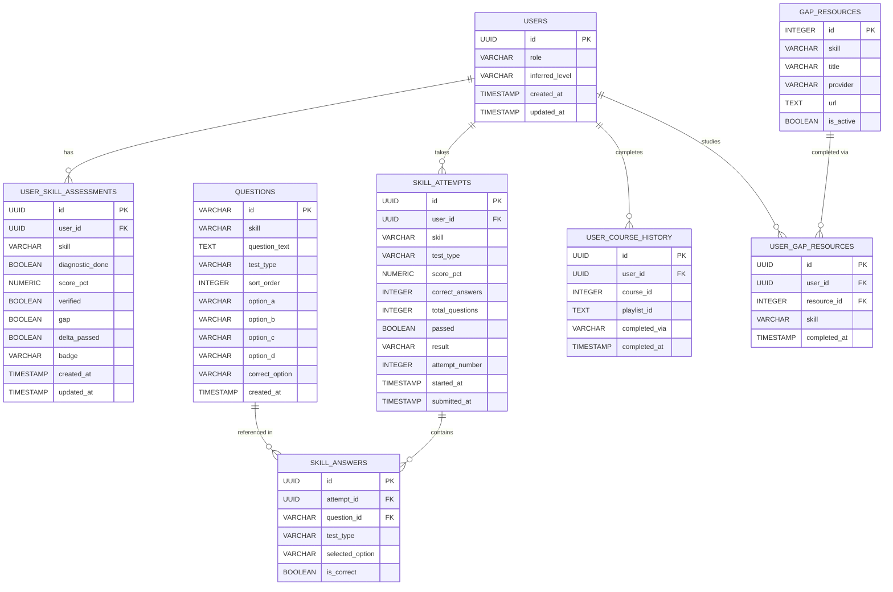

# Database Schema Documentation
## LearningPath Recommendation Engine

---

## Table of Contents

1. [Entity Relationship Diagram](#entity-relationship-diagram)
2. [Database Tables Overview](#database-tables-overview)
3. [Detailed Table Mappings](#detailed-table-mappings)
4. [Relationships and Foreign Keys](#relationships-and-foreign-keys)
5. [Normalization Principles](#normalization-principles)
6. [Index Strategy](#index-strategy)
7. [Data Examples](#data-examples)

---

## Entity Relationship Diagram



---

## Database Tables Overview

The database uses **8 tables** structured across 4 domains:

| Domain | Tables | Purpose |
|---|---|---|
| **User Domain** | USERS | User identity and goal tracking |
| **Assessment Domain** | USER_SKILL_ASSESSMENTS, QUESTIONS, SKILL_ATTEMPTS, SKILL_ANSWERS | Skill verification tests and results |
| **Course Domain** | GAP_RESOURCES | Bridge study material per skill |
| **History Domain** | USER_GAP_RESOURCES, USER_COURSE_HISTORY | Completion tracking and progress |

### Design Decisions

- `SKILL_ATTEMPTS` combines diagnostic and delta attempts — distinguished by `test_type` column
- `SKILL_ANSWERS` combines diagnostic and delta answers — distinguished by `test_type` column
- `QUESTIONS` stores all 4 options as inline columns (`option_a`, `option_b`, `option_c`, `option_d`) since every question always has exactly 4 options — no need for a separate options table
- `REAL_PLAYLISTS` is kept as an in-memory dictionary for POC — not needed as a table until production

---

## Detailed Table Mappings

---

### 1. USERS Table

**Purpose:** Core user identity table. Stores user ID and goal/role for roadmap generation.

| Column | Type | Constraints | Explanation |
|---|---|---|---|
| id | UUID | Primary Key | Unique identifier for each user, autogenerated |
| role | VARCHAR(100) | NOT NULL | User's learning goal e.g. `Backend Developer`, `Frontend Developer` |
| inferred_level | VARCHAR(20) | NOT NULL, DEFAULT=`Beginner` | Auto-detected tier: Beginner / Intermediate / Advanced |
| created_at | TIMESTAMP | NOT NULL, DEFAULT=NOW() | Account creation timestamp |
| updated_at | TIMESTAMP | NOT NULL, DEFAULT=NOW(), ONUPDATE=NOW() | Last modification timestamp |

**Why this table exists:**
- Foundation for all user-specific roadmap and assessment data
- `role` drives which skill curriculum is assigned (Backend Developer → Python, SQL, FastAPI, Docker)
- `inferred_level` is auto-promoted based on how many skills are verified

**Sample Row:**
```
id:              550e8400-e29b-41d4-a716-446655440001
role:            Backend Developer
inferred_level:  Beginner
created_at:      2024-01-15 10:30:00+00
```

---

### 2. USER_SKILL_ASSESSMENTS Table

**Purpose:** Tracks the assessment state of each skill for each user. One row per user per skill.

| Column | Type | Constraints | Explanation |
|---|---|---|---|
| id | UUID | Primary Key | Unique record identifier |
| user_id | UUID | FK (users.id), NOT NULL, INDEXED | Links to parent user |
| skill | VARCHAR(100) | NOT NULL | Skill name e.g. `Python`, `SQL`, `FastAPI`, `Docker` |
| diagnostic_done | BOOLEAN | NOT NULL, DEFAULT=FALSE | Whether diagnostic test has been completed |
| score_pct | NUMERIC(5,2) | NULLABLE | Diagnostic test score percentage (NULL if not done) |
| verified | BOOLEAN | NOT NULL, DEFAULT=FALSE | Whether skill is verified (pass >= 60%) |
| gap | BOOLEAN | NOT NULL, DEFAULT=FALSE | Whether skill has a gap (fail < 60%) |
| delta_passed | BOOLEAN | NOT NULL, DEFAULT=FALSE | Whether delta test was passed |
| badge | VARCHAR(20) | NOT NULL, DEFAULT=`not_assessed` | Current badge: verified / gap / not_assessed |
| created_at | TIMESTAMP | NOT NULL, DEFAULT=NOW() | Record creation timestamp |
| updated_at | TIMESTAMP | NOT NULL, DEFAULT=NOW(), ONUPDATE=NOW() | Last modification timestamp |

**Why this table exists:**
- Central state store for all skill verification logic
- Drives roadmap generation — verified skills are skipped automatically
- One row per user per skill — clean and queryable

**Sample Row:**
```
id:               660e8400-e29b-41d4-a716-446655440002
user_id:          550e8400-e29b-41d4-a716-446655440001
skill:            Python
diagnostic_done:  true
score_pct:        80.00
verified:         true
gap:              false
delta_passed:     false
badge:            verified
```

---

### 3. QUESTIONS Table

**Purpose:** Stores all MCQ questions for both diagnostic and delta tests. Options stored as inline columns since every question always has exactly 4 options.

| Column | Type | Constraints | Explanation |
|---|---|---|---|
| id | VARCHAR(20) | Primary Key | Question identifier e.g. `py_1`, `dpy_1` |
| skill | VARCHAR(100) | NOT NULL, INDEXED | Skill this question tests e.g. `Python` |
| question_text | TEXT | NOT NULL | The actual question prompt |
| test_type | VARCHAR(20) | NOT NULL, DEFAULT=`diagnostic` | Type: `diagnostic` or `delta` |
| sort_order | INTEGER | NOT NULL | Display order within skill (1 to 5) |
| option_a | TEXT | NOT NULL | Option A text |
| option_b | TEXT | NOT NULL | Option B text |
| option_c | TEXT | NOT NULL | Option C text |
| option_d | TEXT | NOT NULL | Option D text |
| correct_option | VARCHAR(1) | NOT NULL | Correct answer: `a`, `b`, `c`, or `d` |
| created_at | TIMESTAMP | NOT NULL, DEFAULT=NOW() | Record creation timestamp |

**Why this table exists:**
- Single table for all questions — simpler than separate diagnostic/delta tables
- Options stored inline since they are always exactly 4 — no need for a separate options table
- `test_type` distinguishes standard diagnostic from harder delta questions
- `correct_option` enables fully automated grading

**Sample Rows:**
```
id: py_1, skill: Python, test_type: diagnostic, sort_order: 1
question_text: What keyword is used to define a generator in Python?
option_a: return  option_b: yield  option_c: async  option_d: pass
correct_option: b

id: dpy_1, skill: Python, test_type: delta, sort_order: 1
question_text: What does *args do in a function signature?
option_a: Keyword arguments  option_b: Variable positional arguments
option_c: Pointer args  option_d: Required args
correct_option: b
```

---

### 4. SKILL_ATTEMPTS Table

**Purpose:** Records every test attempt — both diagnostic and delta — in a single table. Distinguished by `test_type` column.

| Column | Type | Constraints | Explanation |
|---|---|---|---|
| id | UUID | Primary Key | Unique attempt identifier |
| user_id | UUID | FK (users.id), NOT NULL, INDEXED | User who took the test |
| skill | VARCHAR(100) | NOT NULL, INDEXED | Skill being tested |
| test_type | VARCHAR(20) | NOT NULL | Type: `diagnostic` or `delta` |
| score_pct | NUMERIC(5,2) | NOT NULL | Final score percentage (0 to 100) |
| correct_answers | INTEGER | NOT NULL, DEFAULT=0 | Number of correct answers |
| total_questions | INTEGER | NOT NULL, DEFAULT=5 | Total questions in test |
| passed | BOOLEAN | NOT NULL | True if score_pct >= 60 |
| result | VARCHAR(20) | NOT NULL | `passed` or `gap_detected` |
| attempt_number | INTEGER | NOT NULL, DEFAULT=1 | Which attempt this is (for delta retries) |
| started_at | TIMESTAMP | NOT NULL | When user started the test |
| submitted_at | TIMESTAMP | NULLABLE | When user submitted answers |

**Why this table exists:**
- Combines diagnostic and delta attempts — both have identical structure
- `test_type` makes it easy to query just diagnostic or just delta attempts
- `attempt_number` tracks delta retries — user can retry delta multiple times
- Pass on delta flips skill from gap to verified in USER_SKILL_ASSESSMENTS

**Sample Rows:**
```
Diagnostic attempt:
user_id: u1, skill: Python, test_type: diagnostic
score_pct: 80.00, passed: true, result: passed, attempt_number: 1

Delta attempt (after gap):
user_id: u1, skill: SQL, test_type: delta
score_pct: 80.00, passed: true, result: passed, attempt_number: 1
```

---

### 5. SKILL_ANSWERS Table

**Purpose:** Individual answer records for every question in every attempt — both diagnostic and delta.

| Column | Type | Constraints | Explanation |
|---|---|---|---|
| id | UUID | Primary Key | Unique answer record |
| attempt_id | UUID | FK (skill_attempts.id), NOT NULL, INDEXED | Parent attempt |
| question_id | VARCHAR(20) | FK (questions.id), NOT NULL | Which question |
| test_type | VARCHAR(20) | NOT NULL | Type: `diagnostic` or `delta` |
| selected_option | VARCHAR(1) | NOT NULL | Option selected: `a`, `b`, `c`, or `d` |
| is_correct | BOOLEAN | NOT NULL | Whether selected option was correct |

**Why this table exists:**
- Granular answer data for review and analytics
- Enables per-question performance analysis
- Can power future sub-topic gap detection
- Combines diagnostic and delta answers — same structure, distinguished by `test_type`

**Sample Rows:**
```
attempt_id: aa01..., question_id: py_1, test_type: diagnostic, selected_option: b, is_correct: true
attempt_id: aa01..., question_id: py_2, test_type: diagnostic, selected_option: a, is_correct: false
attempt_id: bb01..., question_id: dpy_1, test_type: delta, selected_option: b, is_correct: true
```

---

### 6. GAP_RESOURCES Table

**Purpose:** Curated study resources assigned to users when a gap is detected. User must complete all before delta test unlocks.

| Column | Type | Constraints | Explanation |
|---|---|---|---|
| id | INTEGER | Primary Key | Unique resource identifier |
| skill | VARCHAR(100) | NOT NULL, INDEXED | Skill this resource covers |
| title | VARCHAR(255) | NOT NULL | Resource display name |
| provider | VARCHAR(100) | NOT NULL | Content creator name |
| url | TEXT | NOT NULL | YouTube or external resource URL |
| is_active | BOOLEAN | NOT NULL, DEFAULT=TRUE | Whether resource is currently available |

**Sample Rows:**

| id | skill | title | provider |
|---|---|---|---|
| 501 | Python | Python Full Course | FreeCodeCamp |
| 502 | Python | Python OOP Tutorial | Corey Schafer |
| 503 | SQL | SQL for Beginners | Mosh |
| 504 | SQL | Advanced SQL Queries | Corey Schafer |
| 505 | FastAPI | FastAPI Crash Course | Traversy |
| 507 | Docker | Docker for Developers | TechWorld with Nana |

---

### 7. USER_GAP_RESOURCES Table

**Purpose:** Junction table tracking which gap resources each user has completed.

| Column | Type | Constraints | Explanation |
|---|---|---|---|
| id | UUID | Primary Key | Unique record |
| user_id | UUID | FK (users.id), NOT NULL, INDEXED | User |
| resource_id | INTEGER | FK (gap_resources.id), NOT NULL | Resource completed |
| skill | VARCHAR(100) | NOT NULL | Skill this resource belongs to |
| completed_at | TIMESTAMP | NOT NULL, DEFAULT=NOW() | When user marked it done |

**Why this table exists:**
- Tracks per-user resource completion without modifying the resource table
- All resources for a skill completed → delta test unlocks automatically
- Junction table pattern for M:N relationship between users and resources

---

### 8. USER_COURSE_HISTORY Table

**Purpose:** Records which courses each user has completed. Drives roadmap step states.

| Column | Type | Constraints | Explanation |
|---|---|---|---|
| id | UUID | Primary Key | Unique record |
| user_id | UUID | FK (users.id), NOT NULL, INDEXED | User |
| course_id | INTEGER | NOT NULL, INDEXED | Completed course ID |
| playlist_id | TEXT | NULLABLE | YouTube playlist ID from YouTube Platform |
| completed_via | VARCHAR(20) | NOT NULL, DEFAULT=`manual` | How completed: `manual` or `youtube_platform` |
| completed_at | TIMESTAMP | NOT NULL, DEFAULT=NOW() | When marked complete |

**Why this table exists:**
- Drives roadmap step status — completed vs active vs locked
- `completed_via` distinguishes manual update from YouTube Platform completion event
- `playlist_id` links back to YouTube Platform for traceability

---

## Relationships and Foreign Keys

### 1:N Relationships (One-to-Many)

| Parent | Child | Relationship |
|---|---|---|
| USERS | USER_SKILL_ASSESSMENTS | One user has many skill assessments |
| USERS | SKILL_ATTEMPTS | One user has many test attempts |
| USERS | USER_COURSE_HISTORY | One user has many completed courses |
| USERS | USER_GAP_RESOURCES | One user can complete many gap resources |
| SKILL_ATTEMPTS | SKILL_ANSWERS | One attempt has exactly 5 answers |
| QUESTIONS | SKILL_ANSWERS | One question referenced in many answers |
| GAP_RESOURCES | USER_GAP_RESOURCES | One resource can be completed by many users |

### M:N Relationships (via Junction Tables)

| Relationship | Junction Table |
|---|---|
| USERS and GAP_RESOURCES | USER_GAP_RESOURCES |
| USERS and COURSES | USER_COURSE_HISTORY |

### Cascade Delete Rules

```
Delete USERS
    → deletes USER_SKILL_ASSESSMENTS
    → deletes SKILL_ATTEMPTS → SKILL_ANSWERS
    → deletes USER_COURSE_HISTORY
    → deletes USER_GAP_RESOURCES

Delete GAP_RESOURCES
    → SET NULL on USER_GAP_RESOURCES.resource_id
```

---

## Normalization Principles

### First Normal Form (1NF)
**Satisfied** — All columns contain atomic values
- `option_a`, `option_b`, `option_c`, `option_d` are stored as separate columns — atomic and clean
- No repeating groups anywhere

### Second Normal Form (2NF)
**Satisfied** — Every non-key column depends on the full primary key
- SKILL_ANSWERS: `is_correct` depends on both `attempt_id` and `question_id`
- USER_GAP_RESOURCES: `completed_at` depends on both `user_id` and `resource_id`

### Third Normal Form (3NF)
**Satisfied** — No transitive dependencies
- `question_text` stored in QUESTIONS, not repeated in SKILL_ANSWERS
- Course metadata not duplicated in USER_COURSE_HISTORY

### Intentional Denormalization (for performance)

| Field | Table | Reason |
|---|---|---|
| badge | USER_SKILL_ASSESSMENTS | Derived from verified/gap but stored for fast UI rendering |
| score_pct | USER_SKILL_ASSESSMENTS | Copied from attempt for quick access without join |
| skill | USER_GAP_RESOURCES | Copied from GAP_RESOURCES for fast filtering |
| test_type | SKILL_ANSWERS | Copied from attempt for fast filtering without join |

---

## Index Strategy

| Table | Column | Index Type | Reason |
|---|---|---|---|
| users | id | Primary | Default primary key lookup |
| user_skill_assessments | user_id | Index | Fast skill state lookup per user |
| user_skill_assessments | skill | Index | Filter assessments by skill name |
| skill_attempts | user_id | Index | Retrieve all attempts for a user |
| skill_attempts | skill | Index | Filter attempts by skill |
| skill_attempts | test_type | Index | Filter diagnostic vs delta attempts |
| skill_answers | attempt_id | Index | Load all answers for an attempt |
| questions | skill | Index | Load questions for a skill |
| questions | test_type | Index | Filter diagnostic vs delta questions |
| user_course_history | user_id | Index | Load user's completion history |
| gap_resources | skill | Index | Load resources for a gap skill |

---

## Data Examples

### Full User Journey — Backend Developer

**Step 1 — User created**

```
USERS:
  id: u1 | role: Backend Developer | inferred_level: Beginner
```

**Step 2 — Python diagnostic test taken and passed (score 80%)**

```
USER_SKILL_ASSESSMENTS:
  user_id: u1 | skill: Python | verified: true | score_pct: 80.00 | badge: verified

SKILL_ATTEMPTS:
  user_id: u1 | skill: Python | test_type: diagnostic
  score_pct: 80.00 | correct_answers: 4 | passed: true | attempt_number: 1

SKILL_ANSWERS:
  question_id: py_1 | test_type: diagnostic | selected_option: b | is_correct: true
  question_id: py_2 | test_type: diagnostic | selected_option: c | is_correct: true
  question_id: py_3 | test_type: diagnostic | selected_option: a | is_correct: true
  question_id: py_4 | test_type: diagnostic | selected_option: b | is_correct: true
  question_id: py_5 | test_type: diagnostic | selected_option: a | is_correct: false
```

**Step 3 — SQL diagnostic test taken and failed (score 40%)**

```
USER_SKILL_ASSESSMENTS:
  user_id: u1 | skill: SQL | gap: true | score_pct: 40.00 | badge: gap

SKILL_ATTEMPTS:
  user_id: u1 | skill: SQL | test_type: diagnostic
  score_pct: 40.00 | passed: false | result: gap_detected
```

**Step 4 — User studies gap resources for SQL**

```
USER_GAP_RESOURCES:
  user_id: u1 | resource_id: 503 | skill: SQL | completed_at: 2024-01-21 10:00:00
  user_id: u1 | resource_id: 504 | skill: SQL | completed_at: 2024-01-21 11:30:00
```

**Step 5 — Delta test taken and passed (score 80%)**

```
USER_SKILL_ASSESSMENTS:
  user_id: u1 | skill: SQL | verified: true | delta_passed: true | badge: verified

SKILL_ATTEMPTS:
  user_id: u1 | skill: SQL | test_type: delta
  score_pct: 80.00 | passed: true | attempt_number: 1
```

**Step 6 — Roadmap generated (Python and SQL verified, skipped)**

| Step | Topic | Status | Reason |
|---|---|---|---|
| 1 | Python Basics | review | Verified via assessment |
| 2 | Database Integration | review | Verified via assessment |
| 3 | API Development | **active** | Next to learn |
| 4 | Version Control | locked | Prerequisite not met |

**Step 7 — User completes FastAPI course via YouTube Platform**

```
USER_COURSE_HISTORY:
  user_id: u1 | course_id: 15 | completed_via: youtube_platform | playlist_id: PLxyz
```

**Step 8 — Next roadmap step unlocked automatically**

| Step | Topic | Status |
|---|---|---|
| 1 | Python Basics | review |
| 2 | Database Integration | review |
| 3 | API Development | completed |
| 4 | Version Control | **active** |