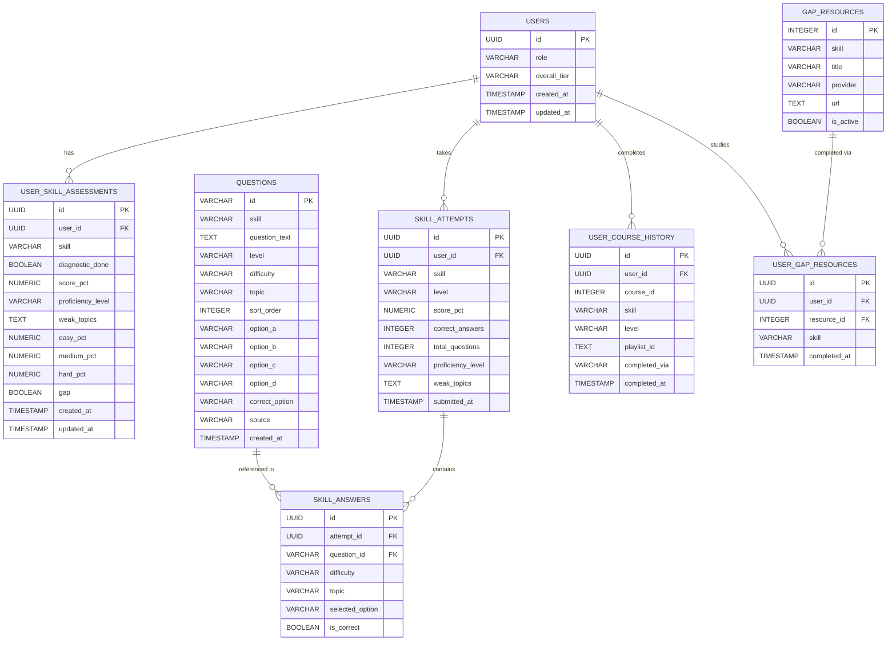

# Database Schema Documentation
## LearningPath Recommendation Engine

---

## Table of Contents

1. [Entity Relationship Diagram](#entity-relationship-diagram)
2. [Database Tables Overview](#database-tables-overview)
3. [Detailed Table Mappings](#detailed-table-mappings)
4. [Relationships and Foreign Keys](#relationships-and-foreign-keys)
5. [Normalization Principles](#normalization-principles)
6. [Index Strategy](#index-strategy)
7. [Data Examples](#data-examples)

---

## Entity Relationship Diagram



---

## Database Tables Overview

The database uses **8 tables** across 4 domains:

| Domain | Tables | Purpose |
|---|---|---|
| **User Domain** | USERS | User identity, goal and overall tier |
| **Assessment Domain** | USER_SKILL_ASSESSMENTS, QUESTIONS, SKILL_ATTEMPTS, SKILL_ANSWERS | Proficiency detection, weak topic tracking, diagnostic results |
| **Course Domain** | GAP_RESOURCES | Bridge study material per skill |
| **History Domain** | USER_GAP_RESOURCES, USER_COURSE_HISTORY | Completion tracking and roadmap progression |

### Key Design Decisions

- `USER_SKILL_ASSESSMENTS` stores `proficiency_level` (Beginner / Intermediate / Advanced) and `weak_topics` per skill — replacing the old pass/fail `verified` and `badge` fields
- `QUESTIONS` has a `difficulty` tag (easy / medium / hard) and `topic` tag per question — enabling proficiency detection and weak topic tracking
- `QUESTIONS` has a `source` field — `hardcoded` for Beginner questions, `ai_generated` for Intermediate and Advanced
- `SKILL_ATTEMPTS` and `SKILL_ANSWERS` are combined into single tables (no separate diagnostic/delta split) — distinguished by `level` column
- Delta test is removed — course completion proves learning instead
- `USER_COURSE_HISTORY` includes `skill` and `level` fields for per-skill level tracking

---

## Detailed Table Mappings

---

### 1. USERS Table

**Purpose:** Core user identity table. Stores user ID, goal and overall tier.

| Column | Type | Constraints | Explanation |
|---|---|---|---|
| id | UUID | Primary Key | Unique identifier for each user, autogenerated |
| role | VARCHAR(100) | NOT NULL | User's learning goal e.g. `Backend Developer` |
| overall_tier | VARCHAR(20) | NOT NULL, DEFAULT=`Beginner` | Overall tier based on weakest skill: Beginner / Intermediate / Advanced |
| created_at | TIMESTAMP | NOT NULL, DEFAULT=NOW() | Account creation timestamp |
| updated_at | TIMESTAMP | NOT NULL, DEFAULT=NOW(), ONUPDATE=NOW() | Last modification timestamp |

**Why this table exists:**
- Foundation for all user-specific roadmap and assessment data
- `role` drives which skill curriculum is assigned
- `overall_tier` is derived from weakest link rule across all assessed skills

**Sample Row:**
```
id:            550e8400-e29b-41d4-a716-446655440001
role:          Backend Developer
overall_tier:  Beginner
created_at:    2024-01-15 10:30:00+00
```

---

### 2. USER_SKILL_ASSESSMENTS Table

**Purpose:** Stores proficiency level and weak topics per skill per user. One row per user per skill.

| Column | Type | Constraints | Explanation |
|---|---|---|---|
| id | UUID | Primary Key | Unique record identifier |
| user_id | UUID | FK (users.id), NOT NULL, INDEXED | Links to parent user |
| skill | VARCHAR(100) | NOT NULL | Skill name e.g. `Python`, `SQL`, `FastAPI`, `Docker`, `Git` |
| diagnostic_done | BOOLEAN | NOT NULL, DEFAULT=FALSE | Whether diagnostic test has been completed |
| score_pct | NUMERIC(5,2) | NULLABLE | Overall score percentage (NULL if not done) |
| proficiency_level | VARCHAR(20) | NULLABLE | Detected level: Beginner / Intermediate / Advanced |
| weak_topics | TEXT | NULLABLE | Comma-separated weak topics e.g. `decorators,concurrency` |
| easy_pct | NUMERIC(5,2) | NULLABLE | Score on easy questions only |
| medium_pct | NUMERIC(5,2) | NULLABLE | Score on medium questions only |
| hard_pct | NUMERIC(5,2) | NULLABLE | Score on hard questions only |
| gap | BOOLEAN | NOT NULL, DEFAULT=FALSE | True if Beginner level detected — gap resources needed |
| created_at | TIMESTAMP | NOT NULL, DEFAULT=NOW() | Record creation timestamp |
| updated_at | TIMESTAMP | NOT NULL, DEFAULT=NOW(), ONUPDATE=NOW() | Last modification timestamp |

**Why this table exists:**
- Central state store for all skill assessment results
- `proficiency_level` drives which content level is assigned in roadmap
- `weak_topics` drives which targeted gap resources are shown alongside each step
- One row per user per skill — clean and queryable

**Sample Row:**
```
id:                660e8400-e29b-41d4-a716-446655440002
user_id:           550e8400-e29b-41d4-a716-446655440001
skill:             Python
diagnostic_done:   true
score_pct:         80.00
proficiency_level: Intermediate
weak_topics:       decorators,concurrency
easy_pct:          100.00
medium_pct:        50.00
hard_pct:          0.00
gap:               false
```

---

### 3. QUESTIONS Table

**Purpose:** Stores all MCQ questions for diagnostic tests across all levels. Beginner questions are hardcoded. Intermediate and Advanced questions are AI-generated and cached here.

| Column | Type | Constraints | Explanation |
|---|---|---|---|
| id | VARCHAR(20) | Primary Key | Question identifier e.g. `py_1`, `py_int_1` |
| skill | VARCHAR(100) | NOT NULL, INDEXED | Skill this question tests e.g. `Python` |
| question_text | TEXT | NOT NULL | The actual question prompt |
| level | VARCHAR(20) | NOT NULL, DEFAULT=`Beginner` | Level: Beginner / Intermediate / Advanced |
| difficulty | VARCHAR(10) | NOT NULL | Bucket: `easy` / `medium` / `hard` |
| topic | VARCHAR(100) | NOT NULL | Specific topic e.g. `decorators`, `joins`, `async` |
| sort_order | INTEGER | NOT NULL | Display order within skill (1 to 5) |
| option_a | TEXT | NOT NULL | Option A text |
| option_b | TEXT | NOT NULL | Option B text |
| option_c | TEXT | NOT NULL | Option C text |
| option_d | TEXT | NOT NULL | Option D text |
| correct_option | VARCHAR(1) | NOT NULL | Correct answer: `a`, `b`, `c`, or `d` |
| source | VARCHAR(20) | NOT NULL, DEFAULT=`hardcoded` | Origin: `hardcoded` or `ai_generated` |
| created_at | TIMESTAMP | NOT NULL, DEFAULT=NOW() | Record creation timestamp |

**Why this table exists:**
- Single table for all questions across all levels and sources
- `difficulty` enables proficiency level detection from performance buckets
- `topic` enables weak topic detection per question
- `source` distinguishes hardcoded Beginner questions from AI-generated ones
- `level` enables filtering questions by tier

**Sample Rows:**
```
id: py_1, skill: Python, level: Beginner, difficulty: easy, topic: data_types
question_text: Which of these is a mutable data type?
option_a: tuple  option_b: str  option_c: list  option_d: int
correct_option: c, source: hardcoded

id: py_int_1, skill: Python, level: Intermediate, difficulty: medium, topic: async
question_text: What is the difference between asyncio.gather and asyncio.wait?
option_a: ...  option_b: ...  option_c: ...  option_d: ...
correct_option: b, source: ai_generated
```

---

### 4. SKILL_ATTEMPTS Table

**Purpose:** Records each user's diagnostic test attempt per skill per level.

| Column | Type | Constraints | Explanation |
|---|---|---|---|
| id | UUID | Primary Key | Unique attempt identifier |
| user_id | UUID | FK (users.id), NOT NULL, INDEXED | User who took the test |
| skill | VARCHAR(100) | NOT NULL, INDEXED | Skill being tested |
| level | VARCHAR(20) | NOT NULL | Level tested: Beginner / Intermediate / Advanced |
| score_pct | NUMERIC(5,2) | NOT NULL | Overall score percentage |
| correct_answers | INTEGER | NOT NULL, DEFAULT=0 | Number of correct answers |
| total_questions | INTEGER | NOT NULL, DEFAULT=5 | Total questions in test |
| proficiency_level | VARCHAR(20) | NOT NULL | Detected level from this attempt |
| weak_topics | TEXT | NULLABLE | Comma-separated weak topics detected |
| submitted_at | TIMESTAMP | NULLABLE | When submitted |

**Why this table exists:**
- Immutable record of each diagnostic attempt
- `proficiency_level` stores what was detected from this specific attempt
- `weak_topics` stores which topics were weak in this attempt
- `level` distinguishes Beginner attempts from Intermediate or Advanced

**Sample Row:**
```
id:                aa0e8400-e29b-41d4-a716-446655440009
user_id:           550e8400-e29b-41d4-a716-446655440001
skill:             Python
level:             Beginner
score_pct:         80.00
correct_answers:   4
total_questions:   5
proficiency_level: Intermediate
weak_topics:       decorators
submitted_at:      2024-01-20 14:10:30+00
```

---

### 5. SKILL_ANSWERS Table

**Purpose:** Individual answer records for each question in a diagnostic attempt.

| Column | Type | Constraints | Explanation |
|---|---|---|---|
| id | UUID | Primary Key | Unique answer record |
| attempt_id | UUID | FK (skill_attempts.id), NOT NULL, INDEXED | Parent attempt |
| question_id | VARCHAR(20) | FK (questions.id), NOT NULL | Which question |
| difficulty | VARCHAR(10) | NOT NULL | Easy / medium / hard — copied for fast analytics |
| topic | VARCHAR(100) | NOT NULL | Topic tag — copied for fast weak topic detection |
| selected_option | VARCHAR(1) | NOT NULL | Option selected: `a`, `b`, `c`, or `d` |
| is_correct | BOOLEAN | NOT NULL | Whether selected option was correct |

**Why this table exists:**
- Granular answer data for review and analytics
- `difficulty` and `topic` copied from question for fast querying without joins
- Enables per-topic and per-difficulty analytics

**Sample Rows:**
```
question_id: py_1, difficulty: easy,   topic: data_types, selected_option: c, is_correct: true
question_id: py_3, difficulty: medium, topic: generators,  selected_option: a, is_correct: false
question_id: py_5, difficulty: hard,   topic: decorators,  selected_option: a, is_correct: false
```

---

### 6. GAP_RESOURCES Table

**Purpose:** Curated study resources assigned when a skill is Beginner level or weak topics are detected.

| Column | Type | Constraints | Explanation |
|---|---|---|---|
| id | INTEGER | Primary Key | Unique resource identifier |
| skill | VARCHAR(100) | NOT NULL, INDEXED | Skill this resource covers |
| title | VARCHAR(255) | NOT NULL | Resource display name |
| provider | VARCHAR(100) | NOT NULL | Content creator name |
| url | TEXT | NOT NULL | YouTube or external resource URL |
| is_active | BOOLEAN | NOT NULL, DEFAULT=TRUE | Whether resource is currently available |

**Sample Rows:**

| id | skill | title | provider |
|---|---|---|---|
| 501 | Python | Python Full Course | FreeCodeCamp |
| 502 | Python | Python OOP Tutorial | Corey Schafer |
| 503 | SQL | SQL for Beginners | Mosh |
| 505 | FastAPI | FastAPI Crash Course | Traversy |
| 507 | Docker | Docker for Developers | TechWorld with Nana |

---

### 7. USER_GAP_RESOURCES Table

**Purpose:** Junction table tracking which gap resources each user has completed.

| Column | Type | Constraints | Explanation |
|---|---|---|---|
| id | UUID | Primary Key | Unique record |
| user_id | UUID | FK (users.id), NOT NULL, INDEXED | User |
| resource_id | INTEGER | FK (gap_resources.id), NOT NULL | Resource completed |
| skill | VARCHAR(100) | NOT NULL | Skill this resource belongs to |
| completed_at | TIMESTAMP | NOT NULL, DEFAULT=NOW() | When user marked it done |

**Why this table exists:**
- Tracks per-user resource completion
- All resources for a skill completed → user is ready to start that roadmap step
- Junction table for M:N between users and resources

---

### 8. USER_COURSE_HISTORY Table

**Purpose:** Records which courses each user has completed per skill and level. Drives roadmap step progression.

| Column | Type | Constraints | Explanation |
|---|---|---|---|
| id | UUID | Primary Key | Unique record |
| user_id | UUID | FK (users.id), NOT NULL, INDEXED | User |
| course_id | INTEGER | NOT NULL, INDEXED | Completed course ID |
| skill | VARCHAR(100) | NOT NULL | Which skill this course belongs to |
| level | VARCHAR(20) | NOT NULL | Level of the course: Beginner / Intermediate / Advanced |
| playlist_id | TEXT | NULLABLE | YouTube playlist ID from YouTube Platform |
| completed_via | VARCHAR(20) | NOT NULL, DEFAULT=`manual` | How completed: `manual` or `youtube_platform` |
| completed_at | TIMESTAMP | NOT NULL, DEFAULT=NOW() | When marked complete |

**Why this table exists:**
- Drives roadmap step status — completed vs active vs locked
- `skill` and `level` enable per-skill level tracking for tier progression
- `completed_via` distinguishes manual update from YouTube Platform completion event
- `playlist_id` links back to YouTube Platform for traceability

---

## Relationships and Foreign Keys

### 1:N Relationships

| Parent | Child | Relationship |
|---|---|---|
| USERS | USER_SKILL_ASSESSMENTS | One user has many skill assessments |
| USERS | SKILL_ATTEMPTS | One user has many test attempts |
| USERS | USER_COURSE_HISTORY | One user has many completed courses |
| USERS | USER_GAP_RESOURCES | One user can complete many gap resources |
| SKILL_ATTEMPTS | SKILL_ANSWERS | One attempt has exactly 5 answers |
| QUESTIONS | SKILL_ANSWERS | One question referenced in many answers |
| GAP_RESOURCES | USER_GAP_RESOURCES | One resource completed by many users |

### M:N Relationships

| Relationship | Junction Table |
|---|---|
| USERS and GAP_RESOURCES | USER_GAP_RESOURCES |
| USERS and COURSES | USER_COURSE_HISTORY |

### Cascade Delete Rules

```
Delete USERS
    → deletes USER_SKILL_ASSESSMENTS
    → deletes SKILL_ATTEMPTS → SKILL_ANSWERS
    → deletes USER_COURSE_HISTORY
    → deletes USER_GAP_RESOURCES

Delete GAP_RESOURCES
    → SET NULL on USER_GAP_RESOURCES.resource_id
```

---

## Normalization Principles

### First Normal Form (1NF)
**Satisfied** — All columns contain atomic values
- `weak_topics` stored as TEXT (comma-separated) — acceptable for Phase 1, normalize to separate WEAK_TOPICS table in production
- Options stored as inline columns (option_a to option_d) — always exactly 4 options

### Second Normal Form (2NF)
**Satisfied** — Every non-key column depends on the full primary key
- SKILL_ANSWERS: `is_correct` depends on both `attempt_id` and `question_id`
- USER_GAP_RESOURCES: `completed_at` depends on both `user_id` and `resource_id`

### Third Normal Form (3NF)
**Satisfied** — No transitive dependencies
- `question_text` stored in QUESTIONS, not repeated in SKILL_ANSWERS
- Course metadata not duplicated in USER_COURSE_HISTORY

### Intentional Denormalization

| Field | Table | Reason |
|---|---|---|
| proficiency_level | USER_SKILL_ASSESSMENTS | Copied from attempt for fast roadmap generation without join |
| weak_topics | USER_SKILL_ASSESSMENTS | Copied from attempt for fast resource assignment without join |
| difficulty | SKILL_ANSWERS | Copied from question for fast difficulty-bucket analytics |
| topic | SKILL_ANSWERS | Copied from question for fast weak topic detection |
| skill | USER_GAP_RESOURCES | Copied from GAP_RESOURCES for fast skill-based filtering |

---

## Index Strategy

| Table | Column | Index Type | Reason |
|---|---|---|---|
| users | id | Primary | Default primary key lookup |
| user_skill_assessments | user_id | Index | Fast skill state lookup per user |
| user_skill_assessments | skill | Index | Filter assessments by skill name |
| skill_attempts | user_id | Index | Retrieve all attempts for a user |
| skill_attempts | skill | Index | Filter attempts by skill |
| skill_attempts | level | Index | Filter attempts by level |
| skill_answers | attempt_id | Index | Load all answers for an attempt |
| questions | skill | Index | Load questions for a skill |
| questions | level | Index | Filter questions by level |
| questions | difficulty | Index | Filter by difficulty bucket |
| user_course_history | user_id | Index | Load user's completion history |
| user_course_history | skill | Index | Filter history by skill |
| user_course_history | level | Index | Filter history by level |
| gap_resources | skill | Index | Load resources for a gap skill |

---

## Data Examples

### Full User Journey — Backend Developer

**Step 1 — User created**
```
USERS:
  id: u1 | role: Backend Developer | overall_tier: Beginner
```

**Step 2 — Python diagnostic test — detected Intermediate, weak in decorators**
```
USER_SKILL_ASSESSMENTS:
  user_id: u1 | skill: Python | proficiency_level: Intermediate
  score_pct: 80.00 | easy_pct: 100 | medium_pct: 50 | hard_pct: 0
  weak_topics: decorators | gap: false

SKILL_ATTEMPTS:
  user_id: u1 | skill: Python | level: Beginner
  score_pct: 80.00 | proficiency_level: Intermediate | weak_topics: decorators

SKILL_ANSWERS:
  question_id: py_1 | difficulty: easy   | topic: data_types | selected_option: c | is_correct: true
  question_id: py_3 | difficulty: medium | topic: generators  | selected_option: b | is_correct: true
  question_id: py_5 | difficulty: hard   | topic: decorators  | selected_option: a | is_correct: false
```

**Step 3 — SQL diagnostic test — detected Beginner, weak in joins**
```
USER_SKILL_ASSESSMENTS:
  user_id: u1 | skill: SQL | proficiency_level: Beginner
  score_pct: 40.00 | easy_pct: 100 | medium_pct: 0 | hard_pct: 0
  weak_topics: joins,grouping | gap: true

SKILL_ATTEMPTS:
  user_id: u1 | skill: SQL | level: Beginner
  score_pct: 40.00 | proficiency_level: Beginner | weak_topics: joins,grouping
```

**Step 4 — User studies gap resources for SQL**
```
USER_GAP_RESOURCES:
  user_id: u1 | resource_id: 503 | skill: SQL | completed_at: 2024-01-21 10:00:00
  user_id: u1 | resource_id: 504 | skill: SQL | completed_at: 2024-01-21 11:30:00
```

**Step 5 — Roadmap generated**

Overall tier → Beginner (weakest link — SQL is Beginner)

| Step | Topic | Content Level | Status | Targeted Resources |
|---|---|---|---|---|
| 1 | Python | Intermediate | active | decorators resource |
| 2 | SQL | Beginner | locked | joins, grouping resources |
| 3 | FastAPI | Beginner | locked | none yet |
| 4 | Docker | Beginner | locked | none yet |
| 5 | Git | Beginner | locked | none yet |

**Step 6 — User completes Python Intermediate course via YouTube Platform**
```
USER_COURSE_HISTORY:
  user_id: u1 | course_id: 2 | skill: Python | level: Intermediate
  completed_via: youtube_platform | playlist_id: PLxyz
```

**Step 7 — Next step unlocked — SQL Beginner becomes active**

| Step | Topic | Content Level | Status |
|---|---|---|---|
| 1 | Python | Intermediate | completed |
| 2 | SQL | Beginner | active |
| 3 | FastAPI | Beginner | locked |
| 4 | Docker | Beginner | locked |
| 5 | Git | Beginner | locked |